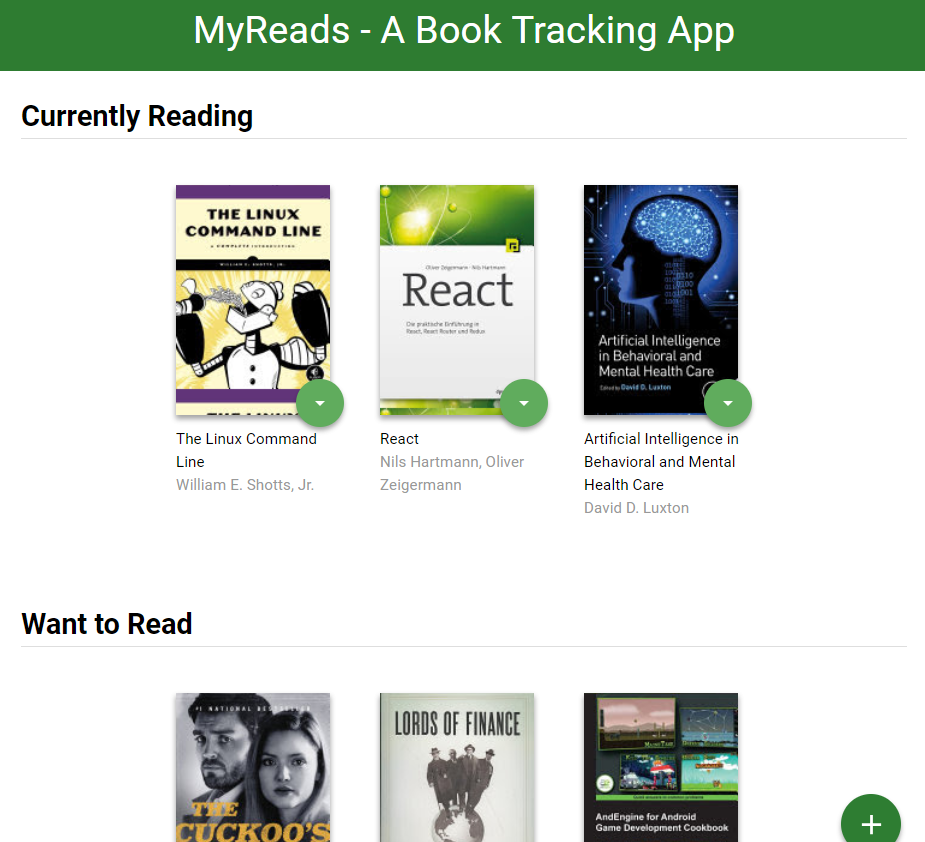

# MyReads Book Tracking App

## Table of Contents

* [Instructions](#instructions)
* [Backend Server / Udacity Books API]
* [Other Contributors](#other-contributors)
* [Contributing](#contributing)
* [Licenses](#licenses)

## Instructions

This project is a simple single-page application that allows users to maintain a list of some of their favorite books. Books can be categorized by the user across three "shelves" - have read, want to read, or are currently reading. The application maintains shelf storage both locally and remotely, and also allows users to search for new books from the Udacity Books API. Once a book is found on the search screen, users can add them to the desired shelf.

In order to run this application, you'll first need to download the below files or clone this repository to get started. The app is built using the React library, so you'll also need to run `npm install` on your terminal while in the project directory to install all project dependencies. Finally, you'll need to run `npm start` in the project directory in order to start the server.

Files that must be downloaded from this repository to run this application include:
1. index.html, restaurants.html
2. service_worker.js, sw_registration.js (includes a service worker for caching / offline usability)
3. css
   * styles.css
   * responsive-index.css, responsive-rest.css (include responsive design features)
3. js
   * main.js
   * dbhelper.js
   * restaurant_info.js
4. img 
   * All included .jpg and .png files (needed to load the restaurant images). 
5. data
   * restaurants.json (needed to pull restaurant list and detail)

This project was bootstrapped with [Create React App](https://github.com/facebookincubator/create-react-app). You can find more information on how to perform common tasks [here](https://github.com/facebookincubator/create-react-app/blob/master/packages/react-scripts/template/README.md).

## Backend Server / Udacity Books API

The application fetches data from the Udacity Books API in order to search for new books, which means internet access is required for all functionality to work correctly. This backend server is required for the project to run correctly, but no additional installation or changes need to be made to the code. The file [`BooksAPI.js`](src/BooksAPI.js) contains all methods that work with this API, as well as its current address.

The backend API uses a fixed set of cached search results and is limited to a particular set of search terms, which can be found in [SEARCH_TERMS.md](SEARCH_TERMS.md). That list of terms are the _only_ terms that will work with the backend, so don't be surprised if your searches for Basket Weaving or Bubble Wrap don't come back with any results.

## Other Contributors

Starter HTML / CSS / JS code and BooksAPI taken from the [Udacity classroom repository](https://github.com/udacity/reactnd-project-myreads-starter).

## Contributing

Since this project is being used as an evaluation for the Udacity FEND, at this time I am **NOT** accepting pull requests. This may change as the project and nanodegree course are completed and I look to optimize the project further, so stay tuned!

For details, check out [CONTRIBUTING.md](CONTRIBUTING.md).

## Licenses

This project is freely available for you to use however you want. If you are a fellow Udacity FEND student, feel free to look at this project for guidance but please do not utilize any of my code in a way that violates Udacity's Honor Code / plagiarism guidelines.